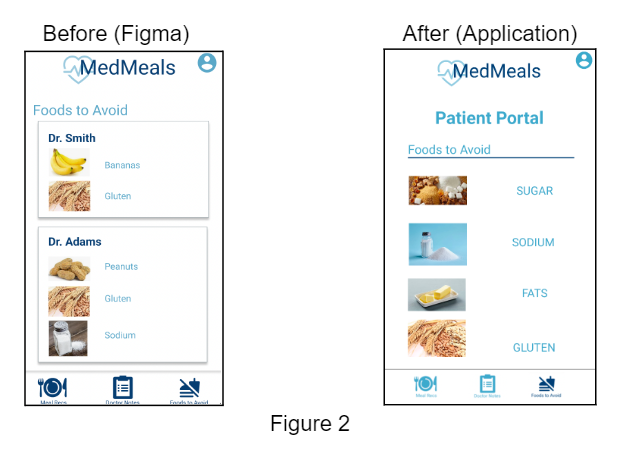

**Group:** Mobile Medics

**Group Members:** Akash Kumar, Shefali Bhatia, Priya Jindal, Vandana Keshavamurthy


**Project Title:** MedMeals

## Problem and solution overview

Maintaining restrictive diets can be a highly taxing and demanding task. In general, patients want to
stay healthy but have difficulty doing so due to limited time, forgetfulness, or the belief that their
dietary needs are impossible to meet; providing a singular mobile app to reference can address all of
these issues.

MedMeals is an application for patients with very restrictive diets in which medical professionals can
input food recommendations and restrictions, in addition to other medically recommended lifestyle
changes, to provide patients with a series of viable food options. Medical professionals can input
information into a diagnosis form in the app for each patient. Patients can then view the information
their doctors have submitted for them by logging into the app and receive dietary options tailored to
their needs.

## Tasks

Primary Task #1: Patient logs in and views the ‘Foods to Avoid’ page **(easy)**

_Task Description:_ This task is focused on a ‘patient’user that wants to view their ‘Foods to Avoid’ page
to be reminded about a list of foods that they should avoid and be careful about due to their dietary
restrictions and medical conditions. The ‘Foods to Avoid’ Page will list these foods categorized by the
name of the doctor that made the recommendation.

Primary Task #2: Doctor fills out form for existing patient **(medium)**

_Task Description:_ This task is focused on a ‘doctor’user wanting to submit a form for an existing
patient. To do so, a doctor will enter their patient’s username, which will allow them to complete a two
page form where they enter a diagnosis and specific recommendations for their patient. Once this
form is completed by a doctor, the information will be refreshed in the patient’s view of the portal.

Primary Task #3: New patient creates an account and views their doctor notes **(hard)**

_Task Description:_ In this task, a new ‘patient’ usernavigates from the application home screen to
create a new account with a desired username and password. Next, they will be led to the patient
portal home page, where they can select the ‘Doctor Notes’ icon from the bottom icon navigation bar.
On the ‘Doctor Notes’ page, the patient user can view diagnoses and additional notes from all their
physicians, categorized by the name of the doctor that completed their diagnosis.


## Revised interface design

### Changes made after low-fi testing and rationale

1. Changes made for improved understandability
    - Change A: Header on the patient portal home page reads “Meal Recommendations” instead
       of “Meal Recs”. _(patient portal home: meal recommendationspage)_
       Rationale: We made this change to make the meaning of “recs” less open-ended and unclear
       because in our low-fi testing, users were confused whether “recs” meant records.
    - Change B: No underlining of meal names. _(patient portalhome: meal recommendations page)_
       Rationale: Underlining the meal names led users to believe that the texts were clickable since
       they resembled standard hyperlink text formatting.
    - Change C: Highlighting the icon corresponding to theuser’s current page in the navigation bar
       at the bottom of the page. _(patient portal: all pages)_
       Rationale: Since all the icons in the navigation bar for the different patient portal pages were
       the same color, users were unclear whether or not the icons corresponded to the page they
       were on.


 <p></p>

- Change: We display a compiled list of all foods to avoid rather than groupings of foods to avoid
    separated by each doctor who provided recommendations. _(patient portal: foods to avoid)_
    Rationale: The list of foods to avoid can become repetitive in the probable event that several
    doctors provided similar recommendations for foods to avoid. Instead, a list consisting of all
    the distinct foods to avoid is more informative to the user.


 <p></p>
 
- Change: The pages for the doctor form are labeled with “page 1 of 2” or “page 2 of 2” to
    indicate which of the two page doctor form a doctor user is on. _(doctor portal: form pages)_
    Rationale: Users were unsure whether the two pages were for the doctor form since they
    lacked any sort of labeling or indication.


 <p></p>
 
2. Changes made for maintaining consistency
    - Change: Added “Patient Portal” text on all Patient portal pages _(patient portal: all pages)_
       Rationale: In our user testing, it was observed that users were confused whether they were
       within the patient portal, so we added an identifier to indicate they are still within the patient
       portal even when navigating across different pages in the patient portal.


 <p></p>
 
- Change: A back button is present at the top right corner of all pages in the app.
    Rationale: Additions such as the back button made to support consistency in our design and
    afford the users with greater flexibility to navigate through the portal.
    Non-standard interactions: Adding the back button enables our app to deal with non-standard
    interactions in an effective way. For example, if a doctor fills out the form for a patient then
    decides they want to start from scratch and not submit any of the information they already filled
    out, the doctor can click the back button on every page they encounter until they reach the
    Doctor Portal Homepage then start the process from scratch.


 <p></p>

### Sketches for unimplemented portions of the interface:

On the first page of the Doctor Portal page, there is a button/option to “View All Patients” which we did
not implement as it is an added functionality more than integral functionality for our app. A rough
sketch is depicted below:

 <p></p>

On all our portal pages, we have an account icon in the top right corner. Hypothetically, this would
lead to a dialog box that provides the option to logout or go to an account information page. We did
not implement this as it is an added functionality more than integral functionality for our app. If we had
it would’ve looked something like this:

```
a. Account Information Page:
```
 <p></p>

```
b. Logging Out:
```
 <p></p>

### Storyboards of tasks:

Task #1: Patient logs in and views the ‘Foods to Avoid’ page

Scenario: Susan is at a new grocery store and wants to buy a frozen meal for dinner. She wants to
cross reference the list of foods to avoid in the MedMeals app to make sure she follows the
recommendations her doctors made.


 <p></p>


Task #2: Doctor fills out form for new patient

Scenario: Dr. Perez has a patient that has been recently diagnosed with diabetes who is struggling to
adhere to their dietary restrictions due to forgetting about them in their day to day life.


 <p></p>


Task #3: New patient creates an account and views their doctor notes

Scenario: Susan received a message from her doctor that she was diagnosed with a disorder
requiring dietary restrictions. The doctor submitted her diagnosis and further details on the application
MedMeals and she wants to check the doctor’s notes.


 <p></p>


## Prototype overview

### Overview of the implemented UI

Our high fidelity prototype is a mobile application with a UI consisting of 10 screens. These screens
support our three primary tasks, which are integral to the functionality of our application. Our backend
uses a SQLite database which has four tables to store all the information relevant to our application.
The first table stores account information for all users with the columns username, password, and
account type (“doctor” vs “patient''). The other three tables store information obtained from the
doctor’s forms for the patients with a foods_to_avoid_table, diagnosis_table, and doctor_notes_table.
The foods_to_avoid table stores a list of foods to avoid, patient username, and doctor username. The
diagnosis_table contains the patient username, doctor username, and diagnosis. The
doctor_notes_table has the columns patient username, doctor username, and doctor’s notes.

Our prototype includes the functionality for creating an account as either a Patient or Doctor user and
logging in. It also allows users to perform the most important tasks for our application such as viewing
meal recommendations, a compiled list of foods to avoid, and all their medical notes and diagnoses
separated by doctor (See Figures 9 and 11 in the storyboard section to view this functionality). In
order to display this information to the patient, when a doctor submits a form for a patient, this
information is persisted into the corresponding database tables. These tables are then queried to
display the appropriate information to the patient. We use hashmaps to map our list of diagnoses to
meal recommendations and map a list of images to the foods to avoid, which are then used to
populate the patient portal pages. Our implementation of the doctor portal enables doctor users to
submit diagnosis forms for multiple patients by entering their patient’s username (See Figure 10 in the
storyboard section to view this functionality). The UI is designed for a

### What was left out and why

Although we added features such as an account icon at the top right of each portal page, we decided
not to provide functionality for users being able to log out since this is not an integral component of our
application’s functionality (See Figure 7 for hypothetical workflow). We also did not implement the
“Account Settings” page (see Figure 8) which would allow a user to view their account type and
username and reset their password. Additionally, on the homepage of the Doctor Portal we have not
implemented or displayed the button to “View All Patients” (see Figure 6 above) since it is an extra
feature, rather than integral functionality to our app; this feature would allow doctors to edit the
submitted forms for old patients instead of submitting a new one.

### Wizard of Oz techniques that are required to make it work

Although the foods to avoid can be input by the user (doctor) in our implementation, we hardcoded the
application to be capable of displaying a maximum of 4 of foods to avoid for a given patient. Similarly,
for the “Doctor’s Notes” page, which displays diagnoses and notes for a given patient distinguished by
the doctor who provided that information, diagnoses and notes are displayed for a maximum of two
doctors. Lastly, we hardcoded a mapping of diagnosis to meal recommendations for a pre-set list of
diagnoses (i.e. Crohn’s, Diabetes, High Blood Pressure, Allergies, and Pregnancy – an input to the
“Other” option on the Doctor Form Page 1 screen). For the “Foods to Avoid” page, we also have a
limited number of foods to avoid that we have mapped to images in our database since we are not
using an external API to map food items to images. Accordingly, the doctor can only enter the


following in the “Food to Avoid” section: eggs, sugar, sodium, corn, dairy, fats, fish, gelatin, gluten,
kiwis, peanuts, sesame, soy, and tree nuts.

### Justification for Trade Off Between Functionality and Completeness

Though using such wizard of oz techniques do not provide for extensiveness in terms of the different
diagnoses doctors can select for patients and the different foods to avoid we support in the
application, it still allows for functionality and demonstrates the workflow of our primary tasks. By
choosing completeness of being able to implement the user interface for all three of our primary tasks
over integrating with an external API that would allow for a wider selection of food inputs, we were
able to spend more time on the database to ensure that the database tables are correctly created and
queried. Thus, although there are limitations in our application, we believe they are justified since we
uphold nonfunctional requirements important to our application like understandability, flexibility, and
protecting sensitive user information.

### Documentation of any code not written by the team (libraries used, etc.)

We utilized SQLite as the basis of our backend infrastructure. Secondly, we employed the Figma
Iconify plugin and Figma Health Icons plugin as the source of icons for our app.

## Prototype video

Link to video: https://youtu.be/qSzP7uCPSOE


